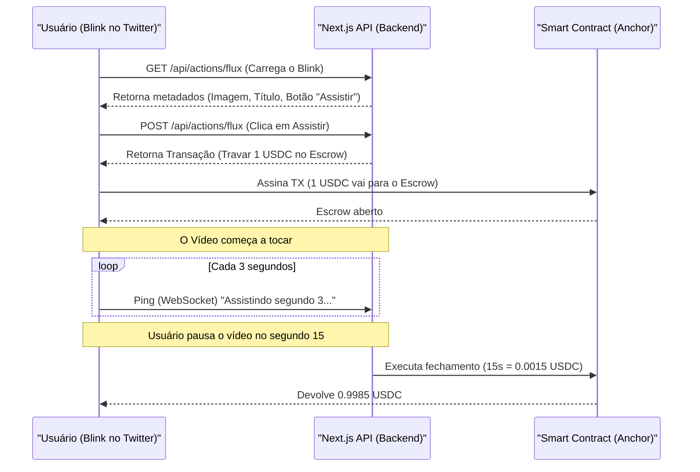

# Arquitetura: FluxBlink

## Conceito
O FluxBlink resolve o problema de monetização contínua usando a velocidade da Solana. Em vez de pagar um "pedágio" fixo para ver um vídeo em um Blink no X/Twitter, o usuário inicia um fluxo de tokens. O pagamento acontece por segundo consumido.

## Componentes

### 1. Smart Contract (Anchor) - `FluxEscrow`
*   **Estado:** Mantém os fundos de "pré-autorização".
*   **Lógica:** Aceita uma assinatura de uma autoridade (backend) atestando quantos segundos foram assistidos.
*   **Liquidação:** Transfere os fundos do escrow para o criador e devolve o troco para o usuário ao finalizar.

### 2. Frontend / Blinks API (Next.js)
*   **API `/api/actions/flux`**: Fornece o GET (metadados do Blink) e POST (construção da transação inicial de abertura do canal).
*   **Blink Custom UI**: Utiliza os componentes `@dialectic/blinks` para renderizar o player de vídeo.
*   **Telemetria:** Abre um WebSocket ou faz polling para um backend informando "O usuário X continua com o player aberto e reproduzindo".

### Fluxograma

