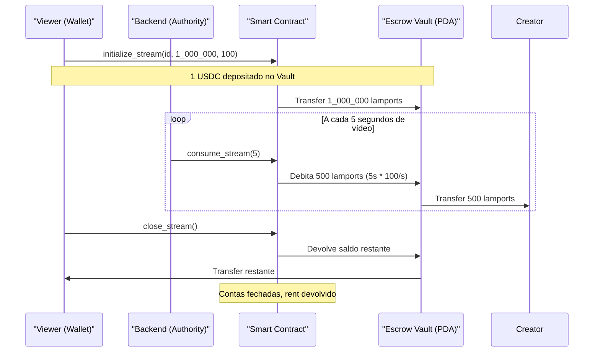

# Smart Contract: FluxEscrow

## Visão Geral
O programa `fluxblink_program` gerencia o ciclo de vida completo de um pagamento por segundo. Ele usa 3 instruções:

```
initialize_stream → consume_stream (N vezes) → close_stream
```

## Contas (PDAs)

### `StreamState` (PDA)
- **Seeds:** `["stream", viewer_pubkey, stream_id_bytes]`
- Armazena o estado do stream: viewer, creator, autoridade do backend, mint, vault, taxa por segundo, total depositado, total consumido, timestamps, e se está ativo.

### `EscrowVault` (PDA Token Account)
- **Seeds:** `["vault", viewer_pubkey, stream_id_bytes]`
- Conta de token controlada pelo programa (PDA authority = a si mesma).
- Armazena os tokens do viewer até que sejam consumidos ou devolvidos.

## Instruções

### 1. `initialize_stream(stream_id, deposit_amount, rate_per_second)`
- **Quem chama:** O Viewer (conecta a carteira, assina a TX).
- **O que faz:**
  1. Cria a conta `StreamState` (PDA).
  2. Cria a conta `EscrowVault` (PDA Token Account).
  3. Transfere `deposit_amount` tokens da carteira do viewer para o vault.
- **Validações:** Depósito > 0, Taxa > 0, Taxa <= 1 USDC/seg.

### 2. `consume_stream(seconds_consumed)`
- **Quem chama:** O Backend (nossa API), usando a chave `authority`.
- **O que faz:**
  1. Calcula `custo = seconds_consumed * rate_per_second`.
  2. Transfere o custo do vault para a conta de token do criador.
  3. Se o saldo do vault acabar, o stream é desativado automaticamente.
- **Validações:** Stream ativo, Authority correta, Seconds > 0.

### 3. `close_stream()`
- **Quem chama:** O Viewer.
- **O que faz:**
  1. Transfere o saldo restante do vault de volta para o viewer.
  2. Fecha a conta `EscrowVault` (rent devolvido ao viewer em SOL).
  3. Fecha a conta `StreamState` (rent devolvido ao viewer em SOL).

## Fluxo Completo



## Erros Customizados
| Código | Nome | Descrição |
|---|---|---|
| 6000 | `ZeroDeposit` | Depósito deve ser > 0 |
| 6001 | `ZeroRate` | Taxa por segundo deve ser > 0 |
| 6002 | `RateTooHigh` | Taxa excede o máximo (1 USDC/seg) |
| 6003 | `StreamInactive` | Stream já foi encerrado |
| 6004 | `ZeroSeconds` | Segundos consumidos deve ser > 0 |
| 6005 | `MathOverflow` | Overflow aritmético |
| 6006 | `Unauthorized` | Signer não tem permissão |
| 6007 | `TokenOwnerMismatch` | Dono da token account incorreto |
| 6008 | `MintMismatch` | Mint incorreto |
| 6009 | `VaultMismatch` | Vault não corresponde ao stream |
